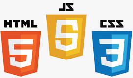

### Howdy Y'all!! 👋

Texas ranch worker, computer programmer, martial artist, and occasional writer. 
 
I seek to learn and help others were I can along the way.

Proverbs 3:13 KJV
> Happy is the man that findeth wisdom, and the man that getteth understanding.

---
I currently do most of my work in: 

Though most of my experience is in back end, 
I do have some basic front end experience with: 

---

As a current moderator on the <a href="https://projectnu.org" target="_blank">Project Nu Forums</a> and <a href="https://discord.com/invite/pQH6Qd4zKm" target="_blank"> Project Nu Discord </a>, you may find be bouncing around there, learning what I can and looking for places to help others learn.

You can find me here on Github, 
and <a href="https://replit.com/@ShaylinTRK" target="_blank"> here </a> on replit. 
Or feel free to shoot me an email at malakai.8bit@outlook.com

 
